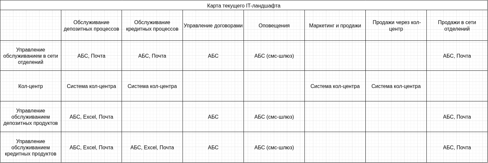
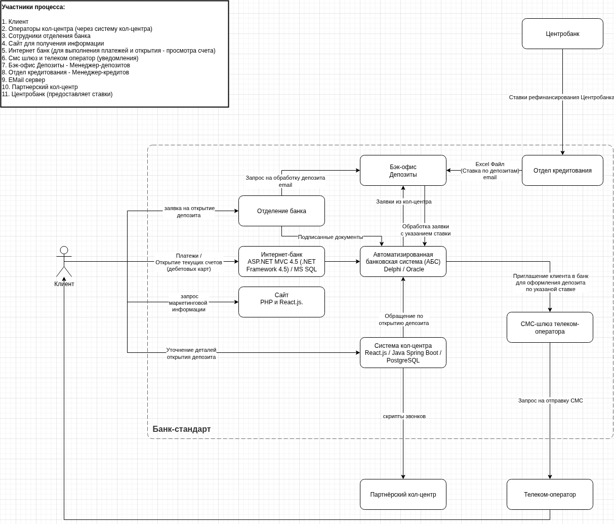
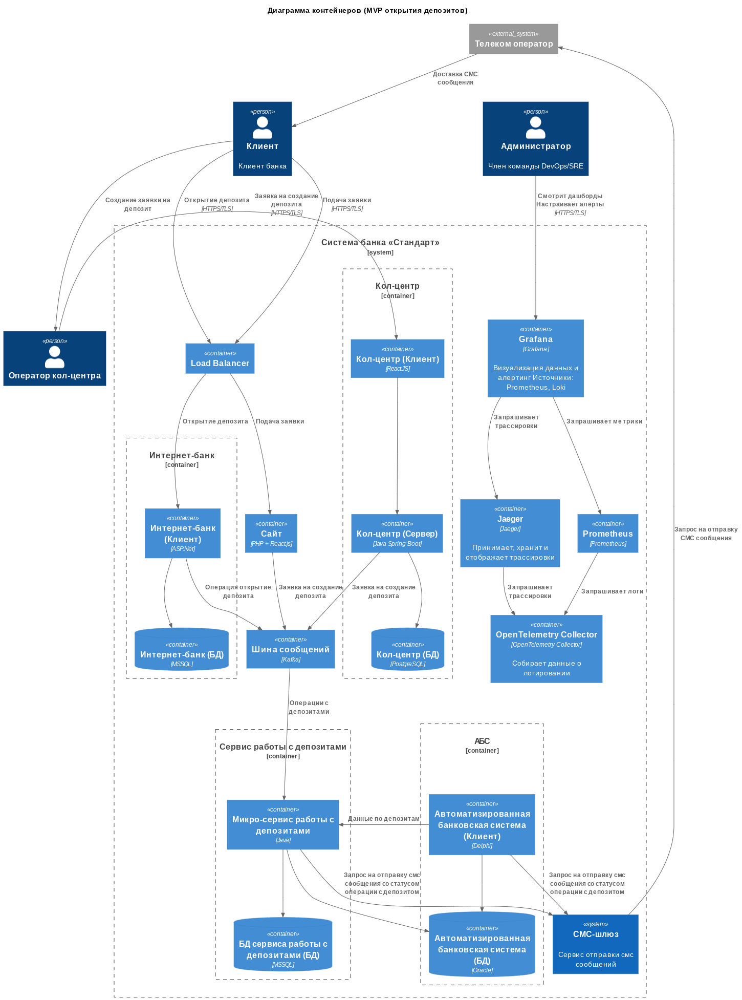
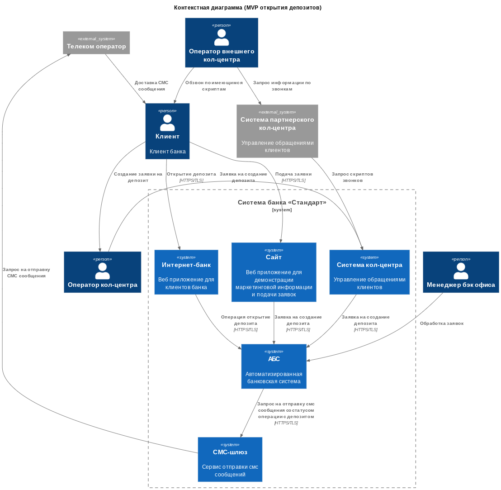
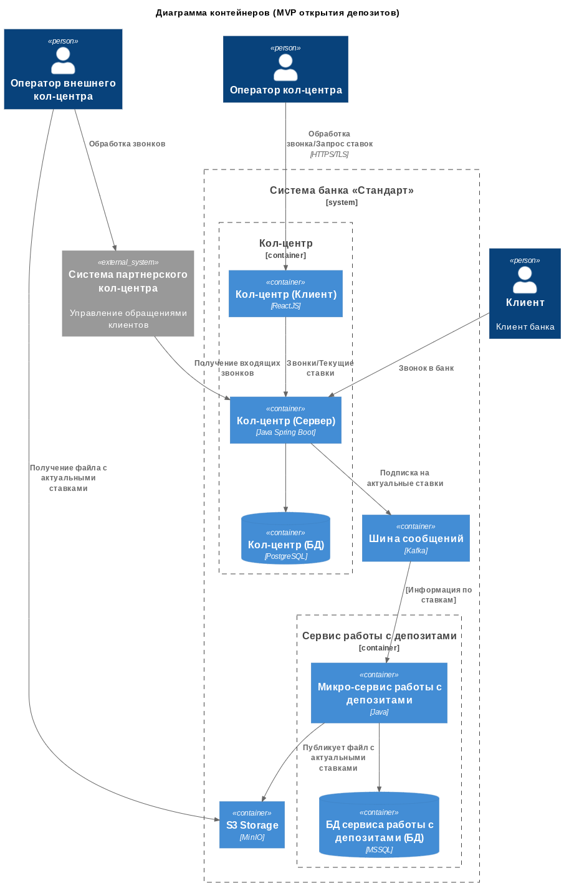
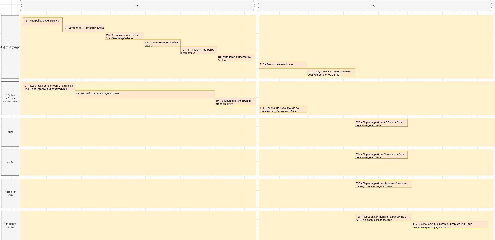

## Задание 1. Карта IT-ландшафта и схема интеграции приложений

**Карта текущего IT-ландшафта:** [landscape.drawio](./Task1/landscape.drawio)

**Схема интеграции приложений с указанием участников процессов:** [integrations-scheme.drawio](./Task1/integrations-scheme.drawio)

## Задание 2. FURPS+ таблица

**Требования в формате FURPS+ таблицы:** [FURPS+ таблица](./Task2/FURPS+.md)

## Задание 3. Открытие депозитов онлайн

**ADR:** [ADR.MD](./Task3/ADR.md)

**Диаграмма контекстов:** [context_c4_diagram.puml](./Task3/context_c4_diagram.puml)

**Диаграмма контейнеров:** [container_c4_diagram.puml](./Task3/container_c4_diagram.puml)

## Задание 4. Передача ставок в кол-центр

**ADR:** [ADR.MD](./Task4/ADR.md)

**Диаграмма контекстов:** [context_c4_diagram.puml](./Task4/context_c4_diagram.puml)

**Диаграмма контейнеров:** [container_c4_diagram.puml](./Task4/container_c4_diagram.puml)

**Дорожная карта**

